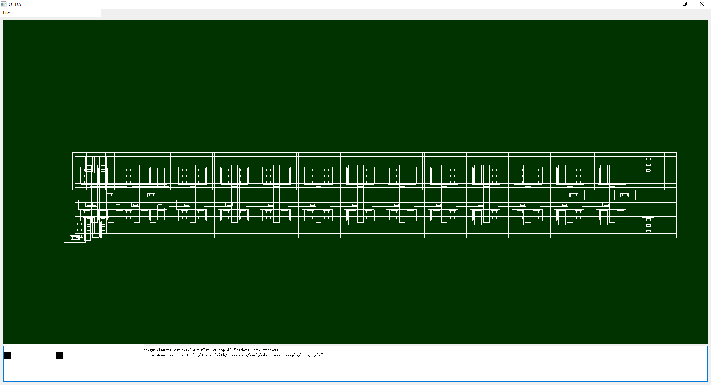

# gds_viewer


## About

This gui application use Qt for interface, [gdstk](https://github.com/heitzmann/gdstk) package for parse gdsii file, use opengl for render geometry.

## Required

Qt5.12 or later
Zlib

## How to build

use cmake

```
mkdir build
cd build
cmake ..
cmake --build .
```

## How to use

see below



use mouse wheel for zoom in an out

hold middle button for move