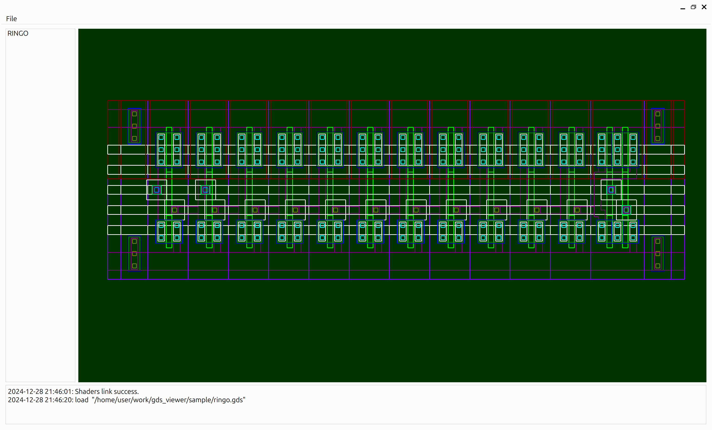

# gds_viewer


## About

This gui application use Qt for interface, [gdstk](https://github.com/heitzmann/gdstk) package for parse gdsii file, use opengl for render geometry.

## Required

Qt6.6.2 or later(lower version may work too, you need to fix qt version in cmake file)
Zlib

## How to build

use cmake

```
mkdir build
cd build
cmake ..
cmake --build .
```

## How to use

see below



use mouse wheel for zoom in an out

hold mouse left button for move

there are some sample gds file in `./sample` folder, you can try them.
